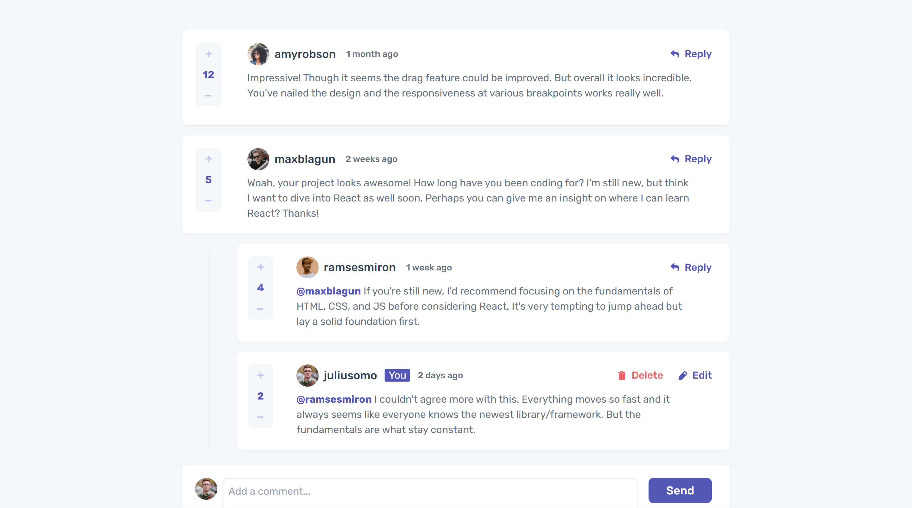
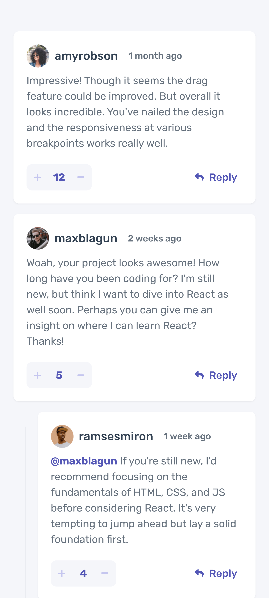

# Frontend Mentor - Interactive comments section

## Table of contents

- [Overview](#overview)
  - [The challenge](#the-challenge)
  - [Screenshot](#screenshot)
  - [Links](#links)
- [My process](#my-process)
  - [Built with](#built-with)
  - [What I learned](#what-i-learned)
  - [Useful resources](#useful-resources)
- [Author](#author)

### Screenshot

Desktop Preview

### Mobile Preview

### Links

- Solution URL: [Frontend Mentor Solution](https://www.frontendmentor.io/solutions/rest-countries-api-with-color-theme-switcher-QRkf_eWLfp)
- Live Site URL: [Live Site at Netlify](https://rest-countries-api-pi-beryl.vercel.app/)
## My process

### Built with
